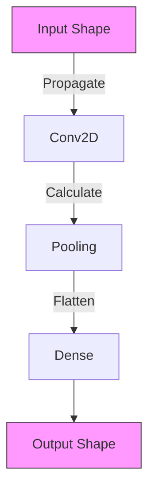

```mermaid
graph TD
    Input[Input Shape] -->|Propagate| Conv2D
    Conv2D -->|Calculate| Pooling
    Pooling -->|Flatten| Dense
    Dense --> Output[Output Shape]
    style Input fill:#f9f,stroke:#333
    style Output fill:#f9f,stroke:#333
```
